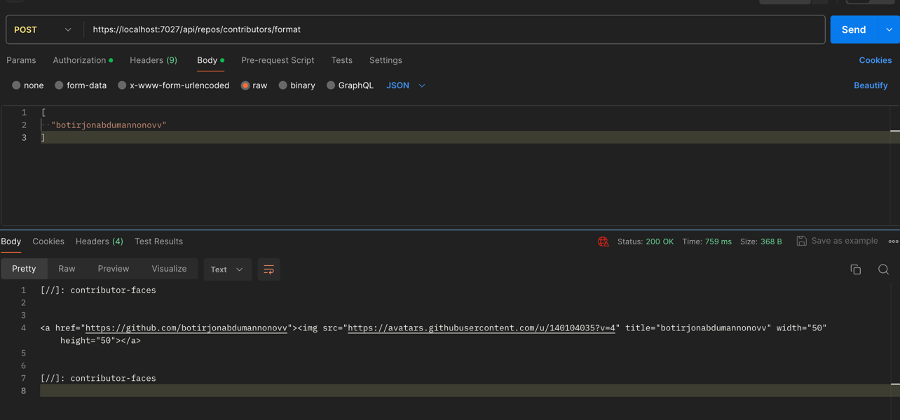

# Github Explorer

This is demo of github API usage

### Features

#### Formatting users

Formatting each contributor to add to repo markdown can take a lot of time, in `api/contributors/format` endpoint we format each passed contributor username to be added to markdown file

Result is formatted markdown in string that when appended to markdown will show contributors

